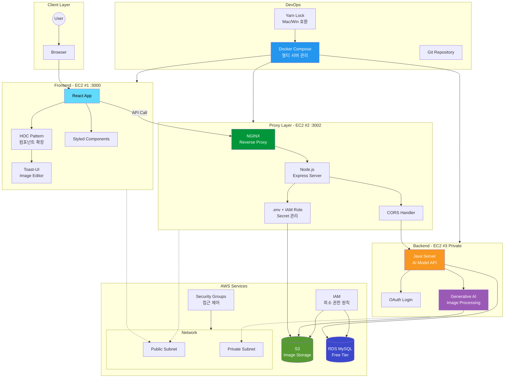

# Portfolio(pptx)
[Wiki](https://github.com/kim-kyoungyeon/JAFAR/wiki)

## diagram

```mermaid
graph TB
    subgraph Client["Client Layer"]
        USER((User))
        BROWSER[Browser]
    end

    subgraph Frontend["Frontend - EC2 #1 :3000"]
        REACT[React App]
        HOC[HOC Pattern<br/>컴포넌트 확장]
        TOAST[Toast-UI<br/>Image Editor]
        STYLED[Styled Components]
    end

    subgraph Proxy["Proxy Layer - EC2 #2 :3002"]
        NGINX[NGINX<br/>Reverse Proxy]
        NODE[Node.js<br/>Express Server]
        CORS[CORS Handler]
        ENV[.env + IAM Role<br/>Secret 관리]
    end

    subgraph Backend["Backend - EC2 #3 Private"]
        JAVA[Java Server<br/>AI Model API]
        OAUTH[OAuth Login]
        GENAI[Generative AI<br/>Image Processing]
    end

    subgraph AWS["AWS Services"]
        subgraph Network["Network"]
            PUB[Public Subnet]
            PRIV[Private Subnet]
        end
        S3[(S3<br/>Image Storage)]
        RDS[(RDS MySQL<br/>Free Tier)]
        IAM[IAM<br/>최소 권한 원칙]
        SG[Security Groups<br/>접근 제어]
    end

    subgraph DevOps["DevOps"]
        DOCKER[Docker Compose<br/>멀티 서버 관리]
        YARN[Yarn Lock<br/>Mac/Win 호환]
        GIT[Git Repository]
    end

    USER --> BROWSER
    BROWSER --> REACT
    REACT --> HOC
    HOC --> TOAST
    REACT --> STYLED

    REACT -->|API Call| NGINX
    NGINX --> NODE
    NODE --> CORS
    CORS --> JAVA
    NODE --> ENV
    ENV --> S3
    
    JAVA --> OAUTH
    JAVA --> GENAI
    GENAI --> S3
    JAVA --> RDS

    Frontend -.-> PUB
    Proxy -.-> PUB
    Backend -.-> PRIV
    
    IAM --> S3
    IAM --> RDS
    SG --> Network

    DOCKER --> Frontend
    DOCKER --> Proxy
    DOCKER --> Backend
    YARN --> DOCKER

    style REACT fill:#61dafb,color:#000
    style NGINX fill:#009639,color:#fff
    style JAVA fill:#f89820,color:#fff
    style S3 fill:#569a31,color:#fff
    style RDS fill:#3b48cc,color:#fff
    style DOCKER fill:#2496ed,color:#fff
    style GENAI fill:#9b59b6,color:#fff
```
